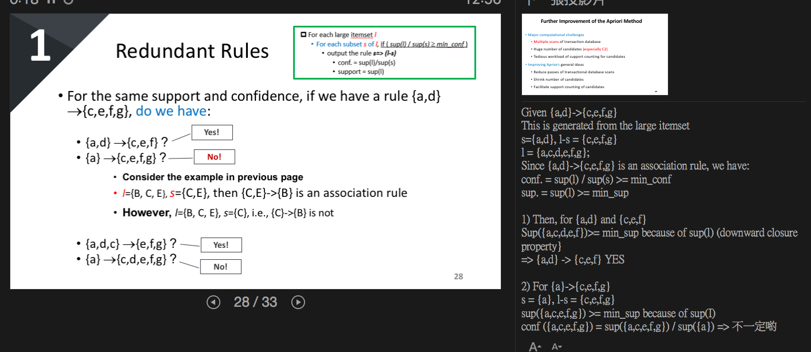

# FreqPat

> <https://www.twblogs.net/a/5b7dd3152b717768385411e0>

## APRIORI

**原理**：如果某個項集是頻繁的，那麼它的所有子集也是頻繁的。該定理的逆反定理爲：如果某一個項集是非頻繁的，那麼它的所有超集（包含該集合的集合）也是非頻繁的。

### Redundant Rules

-----

## FP GROWTH

#### mining fp tree : low-frequent item first.

構建FP樹是算法的第一步，在FP樹的基礎之上再對頻繁項集進行挖掘。爲了構建FP樹，要對數據集掃描兩次，第一次對所有元素項出現次數進行計數，記住如果一個元素不是頻繁的，那麼包含這個元素的超集也不是頻繁的，所以不需要考慮這些超集，第二遍的掃描只考慮那些頻繁元素。

-----

## FPGrowth v.s. Apriori

Data 稀疏的話，FP花較多時間

| Apriori Disadvantage:                                        | Advantage of the FP Growth approach                          |
| ------------------------------------------------------------ | ------------------------------------------------------------ |
| •Scan DB once each iteration à need lots of I/O   •Candidate generation could be very slow  •Huge memory consumption | •Scan DB only **twice** •Much faster than the Apriori approach •Store a compact version of DB in memory |

----

# Clustering

• Cluster homogeneity: the purer, the better
• Cluster completeness: assign objects to same category if they are in ground truth
• Rag bag: e.g., “miscellaneous” or “other” category
• Small cluster preservation: splitting a small category into pieces is more harmful

‧集群同質性：越純越好
‧群集完整性：如果對象屬於基本事實，則將對象分配到同一類別
‧抹布袋：例如，“雜項”或“其他”類別
‧小群集保存：將小類別拆分成碎片更有害