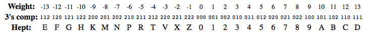
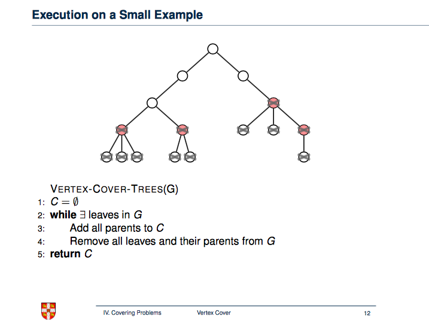
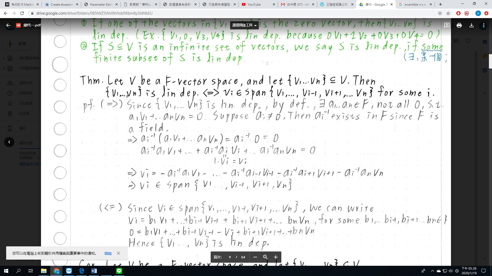

### NTU Introduction to computer(可參考講義）

https://www.csie.ntu.edu.tw/~r03944025/intro2015/#slides

##### Algo & DS note :

http://alrightchiu.github.io/SecondRound/mu-lu-yan-suan-fa-yu-zi-liao-jie-gou.html

https://moptt.tw/p/Grad-ProbAsk.M.1549181983.A.937

##### 計網概參考資料：

http://www.cs.nthu.edu.tw/~nfhuang/contents.htm

---

#### OS system components

- ##### Kernel: Performs basic required functions

  - File manager:

    Directory (or Folder): A user-created bundle of files and other directories (subdirectories)

    Directory Path: A sequence of directories within directories

  - Device drivers

  - Memory manager

  - Scheduler and dispatcher

- ##### List four activities of a typical operating system.

  - Memory Organization
  - File System (and disk) management

  - Program execution + Multitasking (in modern OSs)
  - Hardware detection and management

  - User interface

- ##### What is a real-time operating system?

   Performing the task in accordance with deadlines in its (external real-world) environment.

- ##### What is the role of the user interface of an operating system?

  Handling the communication between users and operation system.

- ##### What is the role of the kernel of an operating system?

  Containing the software components (e.g. file manager, device drivers & memory manager) that perform the basic functions required by the computer installation.

- ##### What is the difference between virtual memory and main memory?

  Virtual memory: A large “fictional” memory space created by paging. Main memory: Real memory unit.

- ##### What is a context switch?

  The procedure of changing from one process to another one, which is managed by dispatcher.

- ##### [CPU / Memory / IO- bound](https://stackoverflow.com/questions/868568/what-do-the-terms-cpu-bound-and-i-o-bound-mean)

  CPU Bound means the rate at which process progresses is limited by the speed of the CPU. A task that performs calculations on a small set of numbers, for example multiplying small matrices, is likely to be CPU bound.

  I/O Bound means the rate at which a process progresses is limited by the speed of the I/O subsystem. A task that processes data from disk, for example, counting the number of lines in a file is likely to be I/O bound.

  Memory bound means the rate at which a process progresses is limited by the amount memory available and the speed of that memory access. A task that processes large amounts of in memory data, for example multiplying large matrices, is likely to be Memory Bound.

- ##### Boot loader

  In a general-purpose computer, a program called the **boot loader** is permanently stored in the machine’s ROM. This, then, is the program that is initially executed when the machine is turned on. The instructions in the boot loader direct the CPU to transfer the operating system from a predetermined location into the volatile area of main memory (Figure 3.5). Modern boot loaders can copy an operating system into main memory from a variety of locations. For example,
  in embedded systems, such as smartphones, the operating system is copied from special flash (nonvolatile) memory; in the case of small workstations at large companies or universities, the operating system may be copied from a distant machine over a network. Once the operating system has been placed in main memory, the boot loader directs the CPU to execute a jump instruction to that area of memory. At this point, the operating system takes over and begins control-
  ling the machine’s activities. The overall process of executing the boot loader and thus starting the operating system is called **booting** the computer.

- ##### Starvation v.s desadlock

  

##### 103 /12.

write a recurrence relation show how many different schedules for these n processes that os scheduler has to evaluate before it can determine the optimal schedule.

---

### 網路：

- #### ECC(error correction code) 

  - ##### [hamming code](https://medium.com/@gordonfang_85054/漢明碼介紹-hamming-code-intro-1c6669f0cff0)
  
  

* #### 網路分層

  架構參考: 

  [1](https://giboss.pixnet.net/blog/post/26798748)  ,  [2](https://www.techbang.com/posts/15859-network-architecture-2-arpanet-history-and-introduction-to-mac-ip-dns-concepts-review?page=2) 

  [分層例題](https://quizlet.com/nl/334549754/networks-flash-cards/)

  **Network**

  A network is a collection of computers and devices connected together, often wirelessly, via communications devices and transmission media. When a computer connects to a network, it is online. Networks allow computers to share resources, such as hardware, software, data, and information. Sharing resources saves time and money. The Internet is a worldwide collection of networks that connects millions of businesses, government agencies, educational institutions, and individuals.

  **Internet**

  The Internet is a worldwide collection of networks that connects millions of businesses, government agencies, educational institutions, and individuals**.** More than one billion people around the world use the Internet daily for a variety of reasons, including the following: to communicate with and meet other people; to conduct research and access a wealth of information and news; to shop for goods and services; to bank and invest; to participate in online training; to engage in entertaining activities, such as planning vacations, playing online games, listening to music, watching or editing videos, and books and magazines; to share information, photos, and videos; to download music and videos; and to access and interact with Web applications.

* #### TCP 與 UDP 的比較

  TCP(Transmission Control Protocol)
  UDP(User Datagram Protocol)
  TCP 這個協定最主要的特色在於傳輸資料時，需要驗證資料，確保正確性。所以花的時間稍多一點。
  而 UDP 這個協定最主要的特色在於傳輸資料時，不需要驗證資料，不保證正確性，所以比較省時間。而一般來說，像是多媒體串流(streaming)就是使用這種協定。

   TCP 跟 UDP 都是網路封包傳送的方式,而網路在傳輸過程中,為了有效使用網路資源,避免過大封包沒傳完,而導致後方所有封包都不能傳送,故所有封包在傳送時都會被分割成小封包,然後在接收端重新組合,而採用 TCP 傳送封包,在接收端會檢查是否所有封包都完整接收到,如果有幾個封包在傳送過程中掉了,接收端會要求傳送端重送,故 TCP 方式傳送可確保封包完整,但唯一缺點是,相對於 UCP,它傳送時間可能會比較久;反之,UDP 在接收端沒有檢查機制,故用 UDP 傳送的小封包,有可能會不見而不被發現,一般 TCP 會被用在比較需要完整性的 protocol 如 email,而 UDP 則用在只求速度,對完整性要求不高,如 syslog 上.

   TCP 提供的是一個連線導向(Connection Oriented)的可靠傳輸， 而 UDP 則是一個非連線型(Connectionless)的非可靠傳輸協定，它並不會運用確認機制來保證資料是否正確的被接收、不需要重傳遺失的資料、資料的接收可不必按順序進行、也不提供回傳機制來控制資料流的速度。因此， UDP 信息可能會在網路傳送過程中遺失、重複，不過速度也可能比接收端的處理速度還快。對於某些訊息量較大、時效性大於可靠性的傳輸來說(像是影音類的).

* #### Unicast / Multicast / Broadcast

  * [Link 1](https://blog.csdn.net/xiaopangzi313/article/details/12831705)  , [Link 2](http://belkin1053.blogspot.com/2011/12/unicastbroadcastmulticast.html)

  
  
  

---

### Tuning machine

原理講解 ＆ Book 12.2

[Link 1](https://zh-tw.coursera.org/lecture/jisuanji-biancheng/tu-ling-ji-de-yun-xing-ji-li-xiTdw)  , [Link 2](https://blog.xuite.net/wellsli/002/32646708-計算機理論的始祖---圖靈機)  , [Link 3](https://mropengate.blogspot.com/2015/05/formal-language-ch9-turing-machines.html) 

##### diagram:     [Source](https://deepai.org/machine-learning-glossary-and-terms/turing-machine)

---

### Production system

[Intoduction](https://blog.csdn.net/embattle/article/details/80074859)

##### water fill [problem](http://problemsandsolutionsforai.blogspot.com/2013/06/water-jug-problem.html):

- [Video](https://www.youtube.com/watch?v=u9KMMudAQ6M)

##### chart: [like tree](https://www.ques10.com/p/30407/explain-water-jug-problem-with-state-space-search-/)

##### [Farmer](https://stackoverflow.com/questions/29643894/the-classic-farmer-wolf-goat-cabbage-production-system-construction):

- [BFS](https://www.cs.unm.edu/~luger/ai-final2/CH4_Depth-.%20Breadth-,%20and%20Best-first%20Search.pdf)

---

### Software engineering

- #### A **module**,

  - encapsulates code and data to implement a particular functionality.
  - has an interface that lets clients to access its functionality in an uniform manner.
  - is easily pluggable with another module that expects its interface.
  - is usually packaged in a single unit so that it can be easily deployed.
  - (1) module 是由數個具基礎功能之元件／組件組成之具特定功能之組件。模組是程式的一部分，一個程式是由許多個獨立開發而成的模組所連結而成。
  - (2)modularization 是指將問題分成幾個小問題來解決。

- #### [Open source v.s Closed source](https://www.coredna.com/blogs/comparing-open-closed-source-software)

  - **open source software :** is available for the general public to use and modify from its original design free of charge
  - **closed source software :** the source code is not shared with the public for anyone to look at or change

- #### [各種測試介紹](https://wayne265265.pixnet.net/blog/post/115545851-[筆記]各種測試介紹)（alpha / beta …etc)

  - [較詳細版](https://ellis-wu.github.io/2015/09/04/test-method-introduction/)

- #### [Black Box testing](https://myweb.ntut.edu.tw/~jykuo/train/UTPartitionMethod_11.pdf)

  - ##### [Boundary Value Analysis](https://kkboxsqa.wordpress.com/2013/11/29/20131129-邊界值分析-boundary-value-analysis-bva/) :

    - ##### another [link](http://autoposter.pixnet.net/blog/post/116884109)

  - ##### [What is Equivalent Class Partitioning?](https://www.guru99.com/equivalence-partitioning-boundary-value-analysis.html#2)

    - ##### 又稱為[**ECT**-**Equivalence Class Testing**](https://kkboxsqa.wordpress.com/2013/11/22/等價類劃分法-equivalence-class-partitioning-ecp/)

    - ##### [csdn](https://blog.csdn.net/vincetest/article/details/1475499)

---

### ALGO / DS

- #### [Fib(n) recursive modified](https://openhome.cc/Gossip/AlgorithmGossip/FibonacciNumber.htm#Python)

  [Code](https://www.geeksforgeeks.org/program-for-nth-fibonacci-number/) 

  

- #### 2's / 3's [complement](http://homepage.divms.uiowa.edu/~jones/ternary/numbers.shtml)

  The negate operation for 3's complement ternary numbers is analogous to the familiar negate operation on 2's complement binary numbers. To negate a 3's complement number, first take the 2's complement of each trit by subtracting it from 2, and then add one to the resulting number. Thus, the 3's complement of 000 is 222+1 or 000, and the three's complement of 111 (representing positive 13) is 111+1 or 112 (representing -13). Unlike the binary system, all ternary numbers have 3's complements because the number range is entirely symmetrical around zero.

  

  

- #### Why is Prim's the best for dense graph & Kruskal's for sparse graph?

  Let’s take a look at the complexity of prim’s algorithm and kruskal’s algorithm. Let’s call number of edges 𝑚 and number of vertices 𝑛.

  Prim’s algorithm has time complexity 𝑂(𝑚+𝑛log(𝑛)) while kruskal’s has time complexity $𝑂(𝑚log(𝑛))$.

  In case of dense graphs, for example when 𝑚=𝜔(𝑛log(𝑛)), prim’s algorithm runs in 𝑂(𝑚), faster than that of kruskal’s which is 𝑂(𝑚log(𝑛)).

  For sparse graphs, say where 𝑚=𝑂(𝑛), we have prim’s running in 𝑂(𝑛log(𝑛)) while kruskal’s running in 𝑂(𝑛log(𝑛)).

  

- #### minimum vertex cover of a tree

  ##### ppt [link](https://www.cl.cam.ac.uk/teaching/1415/AdvAlgo/lec8_ann.pdf)

  ##### proof [correctness](https://cs.stackexchange.com/questions/12177/correctness-proof-of-a-greedy-algorithm-for-minimum-vertex-cover-of-a-tree)

  VERTEX-COVER-TREES(G)

  _C_=∅

  **while** ∃ leaves in _G_

   Add all parents to _C_

   Remove all leaves and their parents from _G_

  **return** _C_

  

  

- #### Euler path

  [euler_hamilton](https://www.csie.ntu.edu.tw/~sprout/algo2017/ppt_pdf/euler_hamilton.pdf)

* #### Design an algorithm for reversing two adjacent entries on one of the stacks.

  Move above to another
  Move adjacent entries then place in reverse order, then retrieve all to the original orders

  by [here](https://quizlet.com/30852691/chapter-8-flash-cards/)

  

* #### a regular BST

  It is counter-intuitive, but it depends how do you construct this tree. If you do not know all the elements of BST in advance ([online algorithm](http://en.wikipedia.org/wiki/Online_algorithm)) then you have to insert each of `n` elements one after another. If you are extremely unlucky, the complexity of insert is `O(n)` and thus it deteriorates to `O(n^2)`.

  Notice that this situation is highly unlikely, but still possible.

  **But you can still achieve O(nlog(n)) if you know all the elements in advance.** You can sort them `O(nlog(n))` and then insert the elements in the following order. [Take the middle element and insert it as a root](http://leetcode.com/2010/11/convert-sorted-array-into-balanced.html), then recursively do the same for both parts that are left. You will end up creating balanced BST, inserting `n` elements using `log(n)`.

* #### Why is Binary Heap Preferred over BST for Priority Queue?

  A typical [Priority Queue](http://geeksquiz.com/priority-queue-set-1-introduction/) requires following operations to be efficient.

  1. Get Top Priority Element (Get minimum or maximum)
  2. Insert an element
  3. Remove top priority element
  4. Decrease Key

  ##### [why is Binary Heap Preferred for Priority Queue?](https://www.geeksforgeeks.org/why-is-binary-heap-preferred-over-bst-for-priority-queue/)

  - Since Binary Heap is implemented using arrays, there is always better locality of reference and operations are more cache friendly.

  - Although operations are of same time complexity, constants in Binary Search Tree are higher.

  - We can build a Binary Heap in O(n) time. Self Balancing BSTs require O(nLogn) time to construct.

  - Binary Heap doesn’t require extra space for pointers.

  - Binary Heap is easier to implement.

  - There are variations of Binary Heap like Fibonacci Heap that can support insert and decrease-key in Θ(1) time

    ##### [Difference between the time complexity required to build Binary search tree and AVL tree?](https://stackoverflow.com/questions/17629668/difference-between-the-time-complexity-required-to-build-binary-search-tree-and)

    ##### [來複習一下資料結構 - Priority Queue](http://blog.lance.tw/posts/2014/07/26/basic-data-structure-priority-queue/)

* #### 106. 2. bit pattern, 

  16-bit machine [參考作業](https://www.csie.ntu.edu.tw/~r03944025/intro2015/files/hw/hw2_ans.pdf)

---

### Linear Algebra

